# 💼 PayrollPro - Enterprise Payroll & Tax System

PayrollPro is a full-stack enterprise-grade Payroll & Human Resource Management System designed to automate employee lifecycle management, payroll processing, and Indian tax computations. It eliminates manual HR operations by providing a centralized, secure, and scalable digital platform.

---

## 📸 Screenshots

### 🔐 Login Page
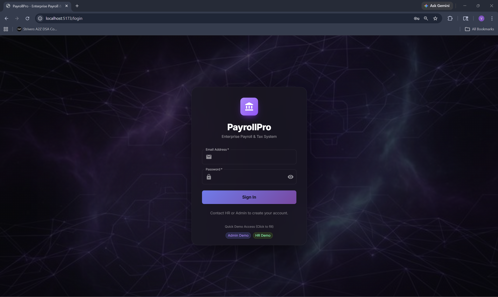

### 📊 HR Dashboard
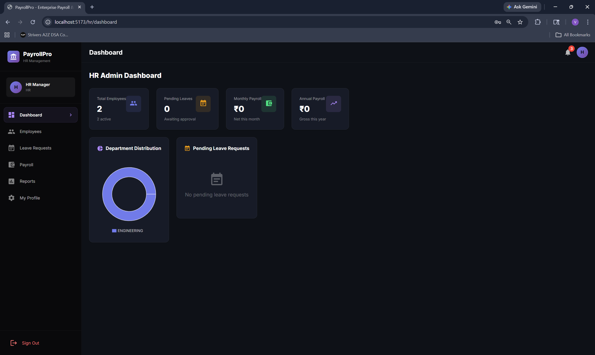

### 👥 Employee Management
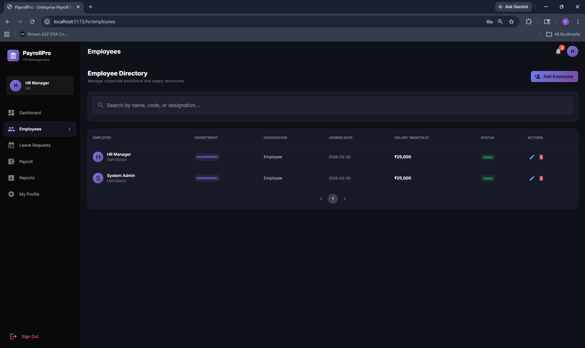

### ➕ Add Employee Modal
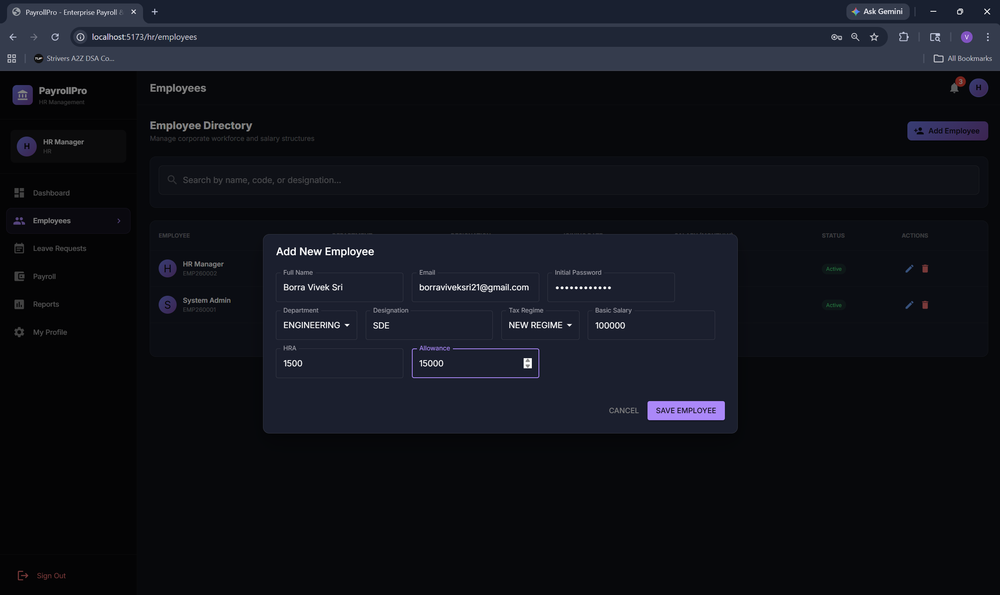

### 👤 Employee Profile
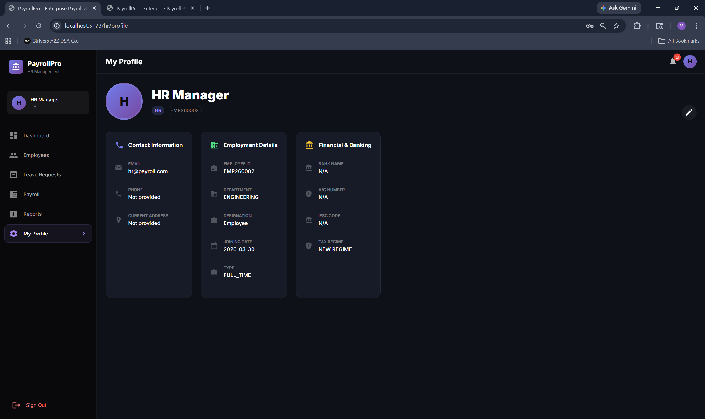

### 🧑‍💼 Employee Dashboard (Initial)
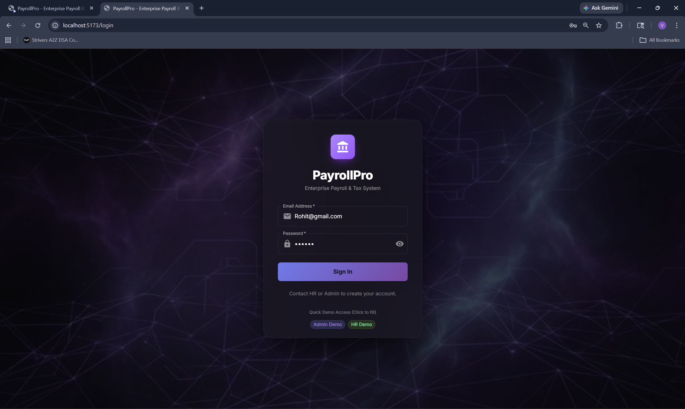

### 📈 Employee Dashboard (After Payroll)
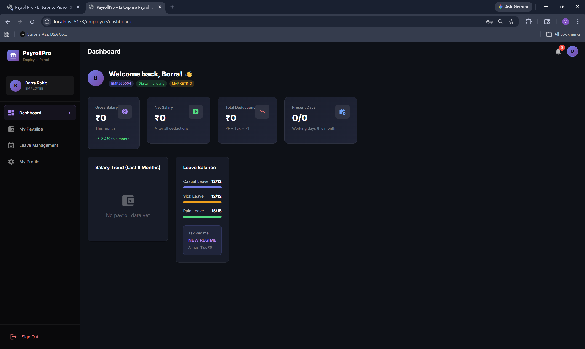

### 🏖️ Leave Management (Empty)
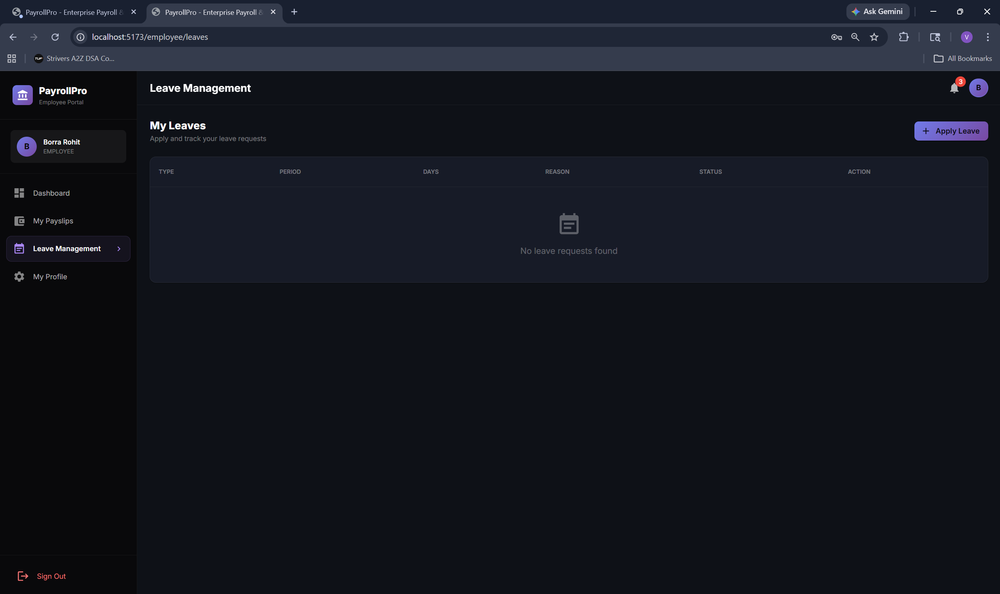

### 📝 Apply Leave Modal
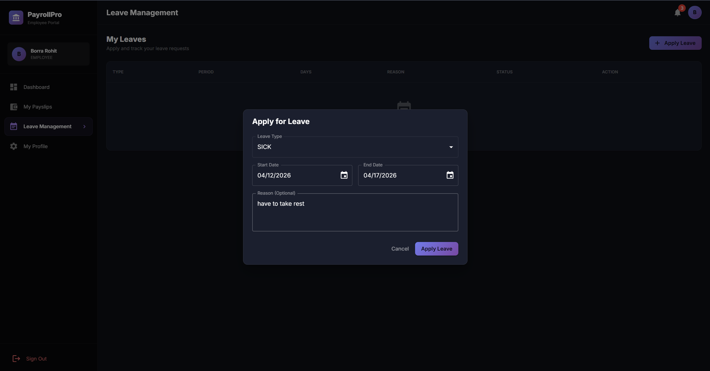

### ⏳ Leave Request (Pending)
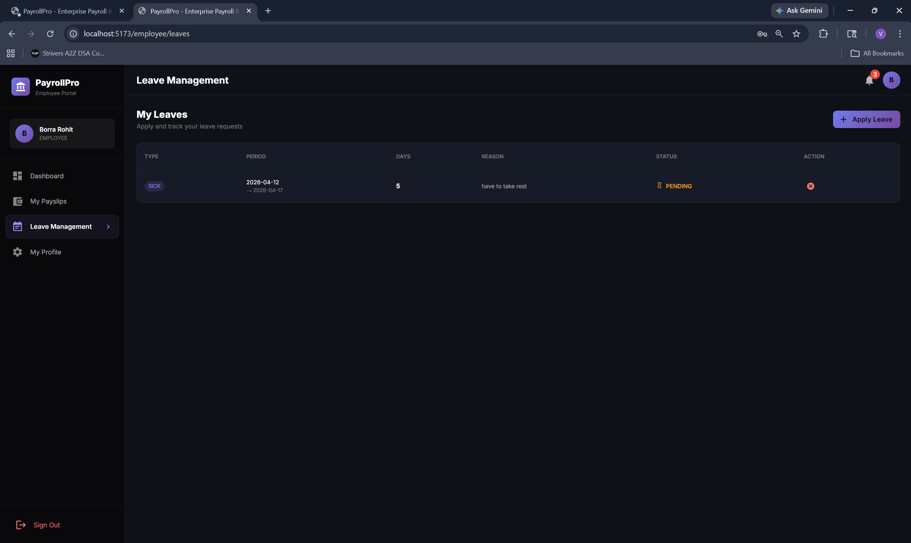

### ✅ Leave Approval (HR)
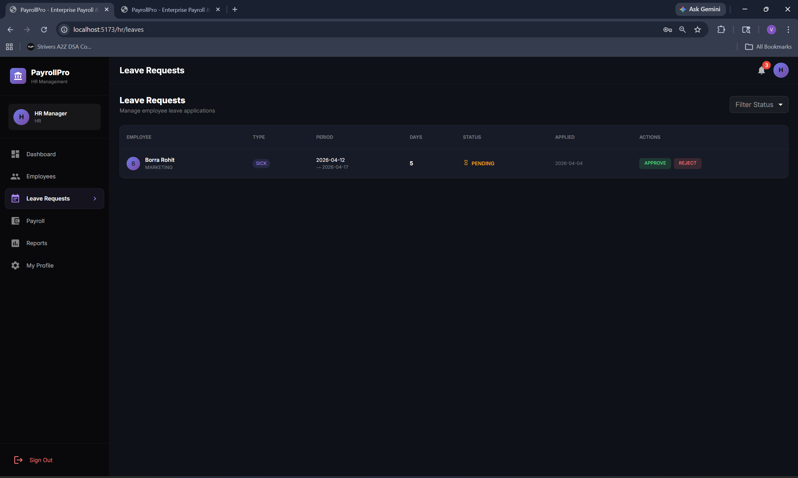

### ✔️ Leave Approved State
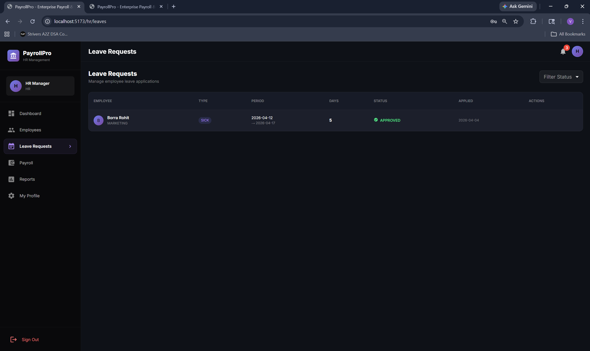

### 💰 Payroll Processing
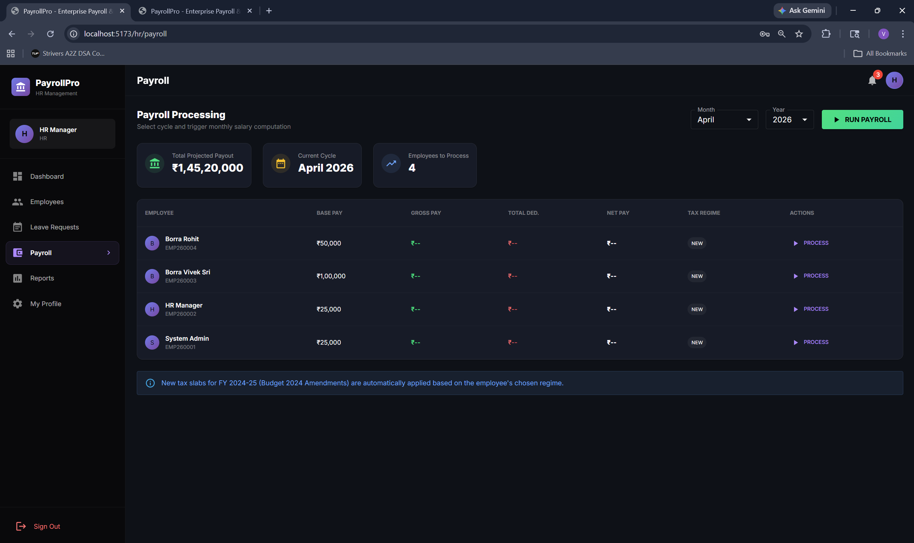

### 📊 Employee Dashboard (Final with Salary)
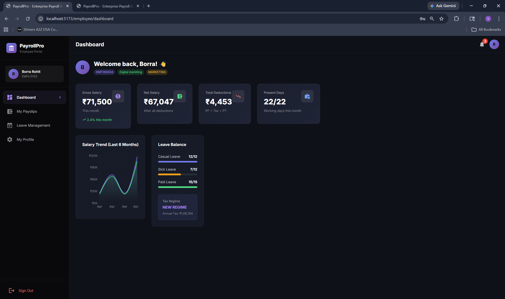

### 📄 Payslip UI
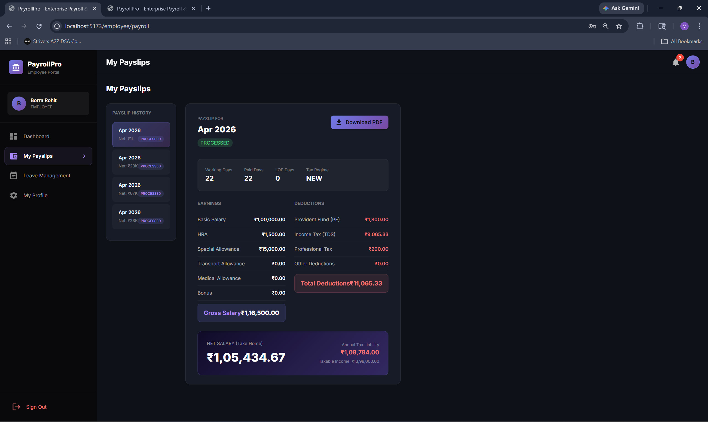

### 🧾 Generated Payslip PDF
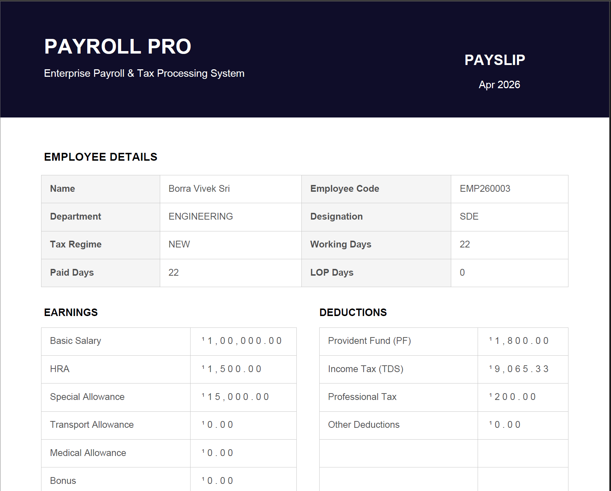

## 🚀 Project Overview

PayrollPro is built using a modern **full-stack architecture** where the backend serves as a stateless REST API and the frontend acts as a responsive Single Page Application (SPA). The system supports three primary roles:

- **Admin**
- **HR Manager**
- **Employee**

Each role has isolated access through **Role-Based Access Control (RBAC)** ensuring security, data privacy, and clear separation of responsibilities.

---

## 🧠 Core Features

### 👥 Employee Lifecycle Management
- Create, update, and manage employee records
- Store critical financial data (PAN, Aadhaar, UAN, Bank Details)
- Automatic leave allocation on onboarding
- Department & designation mapping

### 🏖️ Leave Management System
- Employees can apply for leave with date validation
- Automatic calculation excluding weekends
- Real-time leave balance tracking
- HR approval/rejection workflow
- Prevents over-utilization of leave

### 💰 Intelligent Payroll Engine
- One-click monthly payroll processing
- Automatic salary computation based on attendance
- Loss of Pay (LOP) deduction handling
- Dynamic allowance and deduction calculation

### 🇮🇳 Indian Tax Computation
- Supports both **Old and New Tax Regimes**
- Section 87A rebate handling
- Standard deductions (₹50,000 / ₹75,000)
- Tax slab calculations (5%–30%)
- 4% Health & Education Cess

### 📊 Dashboard & Analytics
- HR dashboard with real-time insights
- Employee dashboard with salary breakdown
- Visual charts using Recharts
- Payroll trends and department distribution

### 📄 Payslip Generation
- Dynamic PDF payslip generation
- Detailed earnings & deductions breakdown
- Downloadable and printable format

---

## 🏗️ Architecture

PayrollPro follows a **decoupled API-driven monolithic architecture**:

- Backend → Handles business logic & security
- Frontend → Handles UI rendering
- Communication → REST APIs (JSON)

This ensures scalability, maintainability, and independent development cycles.

---

## ⚙️ Tech Stack

### 🔹 Backend
- **Java 17 / 20**
- **Spring Boot 3**
- **Spring Security 6**
- **JWT Authentication**
- **Hibernate (JPA)**
- **MySQL 8**
- **Lombok**
- **MapStruct**
- **iTextPDF (PDF generation)**

### 🔹 Frontend
- **React 19**
- **Vite**
- **Redux Toolkit**
- **React Router DOM**
- **Material UI (MUI)**
- **Axios (with interceptors)**
- **Recharts**

---

## 🔐 Authentication & Security

- Stateless authentication using **JWT tokens**
- Password hashing using **BCrypt**
- Role-based authorization (Admin, HR, Employee)
- Secure API endpoints via Spring Security filters
- Token validation on every request

---

## 🔄 Workflow Overview

### 1️⃣ Employee Onboarding
- HR creates employee profile
- System assigns leave balances
- User account is generated automatically

### 2️⃣ Leave Application
- Employee submits leave request
- Backend validates leave balance & dates
- HR approves/rejects request
- Leave balance updated automatically

### 3️⃣ Payroll Processing
- HR triggers monthly payroll
- System calculates:
  - Working days
  - LOP (Loss of Pay)
  - Allowances
  - Deductions (PF, PT, TDS)
- Net salary is computed

### 4️⃣ Payslip Generation
- Payslip generated dynamically
- Employees can download PDF anytime

---

## 📊 Database Design

- Relational schema using **MySQL**
- Strong data integrity via foreign keys
- Efficient joins for payroll + leave + tax data
- Optimized queries using JPA repositories

---

## 🎨 UI/UX Highlights

- Modern **Glassmorphism dark theme**
- Responsive design
- Clean dashboard layouts
- Smooth navigation (SPA)
- Real-time UI updates via Redux

---

## 🔌 API Communication

- Axios used for API calls
- Global interceptors automatically attach JWT tokens
- Centralized error handling
- Clean separation of API services

---

## 📈 Performance & Optimization

- Vite enables ultra-fast frontend builds
- MapStruct avoids runtime reflection overhead
- Hibernate optimizes database interaction
- Stateless backend improves scalability

---

## 🛠️ Setup Instructions

### ⚡ 1-Click Start (Windows)
We provide a convenient PowerShell script to start both servers simultaneously:
```powershell
cd "d:\ADV JAVA"
.\start.ps1
```

### ⚙️ Manual Setup

**Backend Setup**
```bash
cd payroll-backend
# Ensure JAVA_HOME is pointing to JDK 17+
mvn clean install
mvn spring-boot:run
```

**Frontend Setup**
```bash
cd payroll-frontend
npm install
npm run dev
```

**Database Configuration**
Ensure MySQL is running on port 3306. The application will automatically create the `payroll_db` schema. Update the credentials in `application.properties` as needed.

*The application UI will become available at `http://localhost:5173`.*
